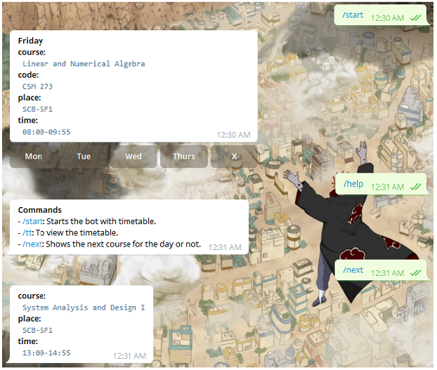

# tg-timetable-bot

## What is this
This is a simple bot to display timetable data stored in a json file.

## Usage
You can run your own bot instance by forking / cloning the bot and modifying the json file with your own data.
